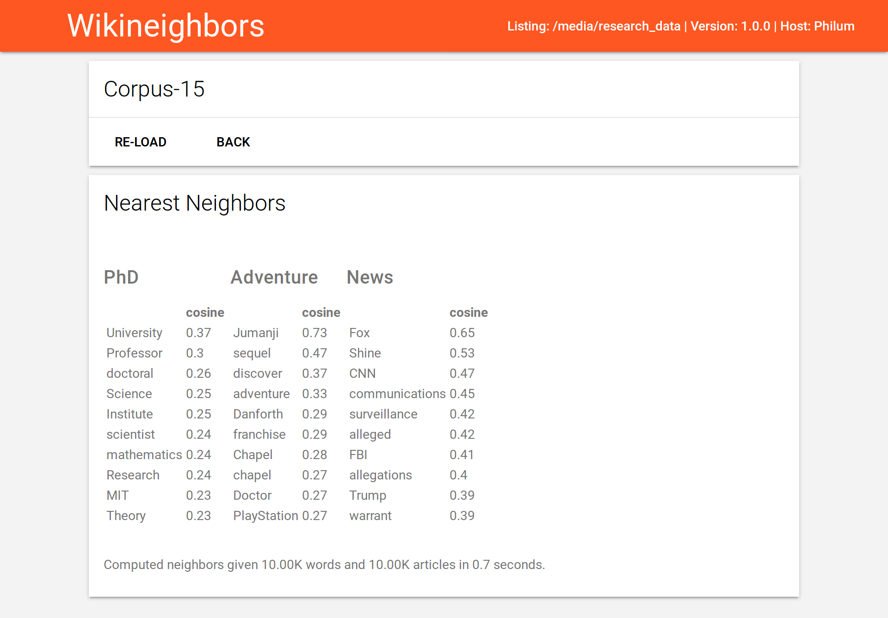

# WikiNeighbors

Show neighbors in Wikipedia co-occurrence space via browser app

## Performance

### Speed

The following table shows the time it takes to count all the words for a subset of Wikipedia articles
Despite the fact that the text files are stored remotely (on [Ludwig](https://github.com/phueb/Ludwig)), counting is slower when performed directly on the remote server.
This means that loading the text files over the network is not a bottleneck;
 rather it is the CPU intensive operations that `spacy` performs during tokenization.

| # words |  # docs   | network-read      | seconds | memory (GB) |
|------- -|-----------|-------------------|---------|-------------|
|   1,000 | 1,000,000 | True              |    3870 |          13 |
|   5,000 | 1,000,000 | True              |    3870 |          20 |

Most of this time is spent on tokenization, lemmatization.
No matrix normalization or SVD operations are performed on the co-occurrence matrix.

Time spent counting is trivial relative to time spent in `spacy` operations.
This is true despite that all words are counted, and a large dictionary of counts must be updated.

Accessing the text files via VPN and a slow network connection does not add significant overhead.
Future work should focus on faster tokenization, which may involve moving away from `spacy`. 

### Memory

Let's say we want to use a vocabulary size of 1000 and include all Wiki articles when computing the co-occurrence matrix.
Does the matrix fit into 32GB of memory?
Because Wikipedia articles contain on average 320 words, it is safe to use 16bit integer representation.
If we used 8bit integer representation, we would have no way of capturing that some word may occur more than 256 (=2^8bits) times in a single article.
This means that each column, representing each Wikipedia article, requires 2,000 bytes of memory. 
Because there are 3.2e^10 bytes in 32GB, we can fit D = 3.2e^10 / 2,000 = 16,000,000 document vectors into our machine's memory. 
This means we can include 16 million articles when building the co-occurrence matrix before running out of memory.
As there are currently 5 million articles in the English Wikipedia, 32GB is sufficient to include all articles, provided we limit our analysis to only 1000 words.

## TODO

* allow user to enter a pair of words and retrieve similarity
* javascript progressbar when caching vocab

The similarity matrix is too large to compute in-memory.
Instead, save the int16 co-occurrence matrix and compute similarities only for those words requested by user. 
